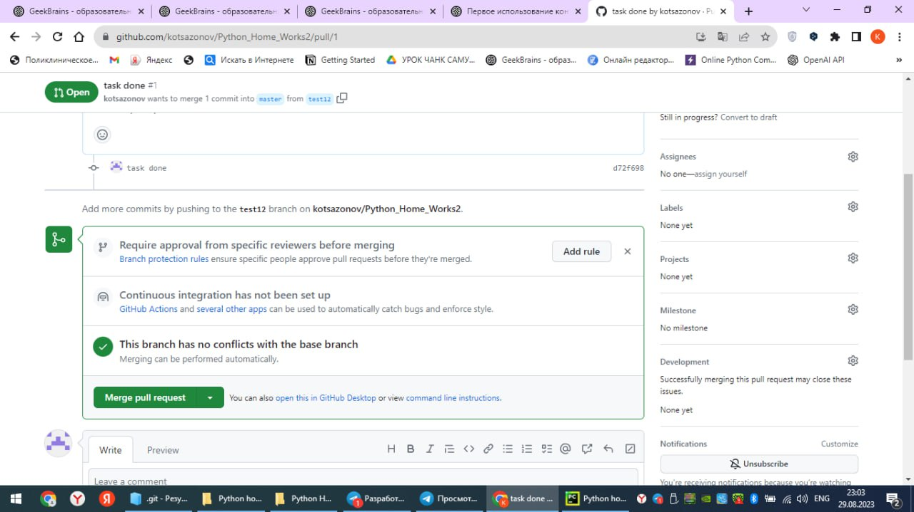
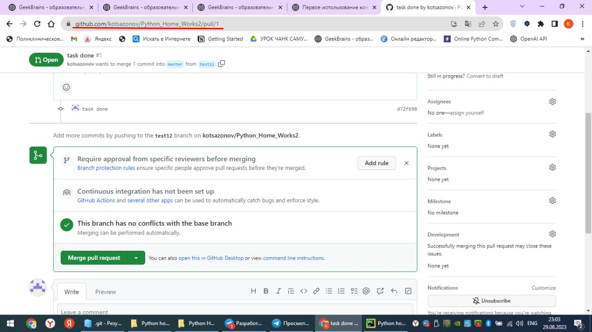

# Инструкция по созданию pull request в собственный репозиторий  
Инструкция позволит по шагам создать **pull request** в собственный репозиторий. При этом она не затрагивает настройку **Git** и подключения удаленного репозитория. Таким образом предполагается, что первоначальную настройку **Git** вы уже осуществили и у вас есть зарегистрированный аккаунт на [GitHub](https://github.com/) .  

## **Содержание**  

[1. Создание репозитория на GitHub](#1-создание-репозитория-githubcom)  
[2. Клонирование репозитория на ваш компьютер](#2-Клонирование-репозитория-на-ваш-компьютер)  
[3. Создание отдельной ветки](#3-Создание-отдельной-ветки)  
[4. Размещение файлов на локальном компьютере](#4-Размещение-ДЗ)  
[5. Добавление файлов в отслеживание](#5-Добавление-файлов-в-отслеживание)  
[6. Отправка файлов в удаленный репозиторий](#6-отправка-файлов-в-удаленный-репозиторий)  
[7. Создание pull request](#7-Создание-pull-request)  
[8. Возможные проблемы и их решения](#8-возможные-проблемы-и-решения)

## Введение:
Создание **pull request** в собственный репозиторий удобно тогда, когда вы делаете какую-то работы и хотели бы, чтобы другие люди могли комментировать её не создавая **fork** вашего репозитория. В этом руководстве мы будем использовать консоль для ввода команд. Команды касающиеся **git** одинаковы для **Linux**, **Windows**, и **MacOS**.

### 1. Создание репозитория [GitHub.com](https://github.com)  
Перво-наперво необходимо создать репозиторий, в котором вы хотите размещать свою работу или работы. 
>**Обязательно убедитесь, что ваш репозиторий не private, а public! Иначе его не смогут увидеть другие пользователи**  

Не будем рассматривать детально, как это сделать, примем это как обязательное действие. Дополнительно, как создавать репозитории, вы можете прочитать **[здесь](https://git-scm.com/book/ru/v2/GitHub-Сопровождение-проекта)**. После того как создали свой репозиторий, необходимо скопировать адрес нашего репозитория, мы будем его дальше использовать. 
Где скопировать адрес репозитория:

На этом пока **GitHub**  откладываем.

### 2. Клонирование репозитория на ваш компьютер
Принципиально при работе с **git**,локальная папка, должна соответствовать одному удаленному репозиторию, что бы не возникало ошибок. И так, мы должны открыть консоль, это может быть консоль ***(далее терминал)*** в операционной системе, либо терминал в **IDE**, в которой вы работаете. Далее убедиться что мы находимся в нужной папке (в эту папку будет копироваться  репозиторий с **[github.com](https://github.com)**)
Чтобы убедиться, что мы находимся в нужной папке, необходимо обратить внимание на приглашение в командной строке вашего терминала. Это приглашение должно оканчиваться именем папки, которая нам нужна. Переход по папкам осуществляется при помощи команды  

`cd "имя папки"`

 Другую справку по этой команде можно найти **[здесь](https://learn.microsoft.com/ru-ru/windows-server/administration/windows-commands/cd)** или **[здесь](https://habr.com/ru/articles/501442/)**. Для примера будем использовать папку "repo".
**Обычный терминал**  

 

**Терминал VsCode**  

**Когда мы убедились, что находимся в нужной папке!**  
Вводим команду:  

`git clone "здесь вставляем адрес, который мы скопировали ранее"` 

Наш удаленный репозиторий должен cкопироваться в папку 'repo', отдельной папкой с названием репозитория. Переходим в эту скопированную папку.  

>Есть другие способы назначить соотнести локальную папку с удаленным репозиторием ***(здесь и далее, локальная - это отслеживаемая папка на вашем компьютере, папка в которой сделан git init, удаленный - это репозиторий на сайте [github.com](https://github.com))***,  в этой инструкции мы не будем их рассматривать, вы можете самостоятельно посмотреть ***[здесь](https://git-scm.com/book/ru/v2/Основы-Git-Работа-с-удалёнными-репозиториями)***

### 3. Создание отдельной ветки
Мы находимся в папке с названием репозитория, пока в ней должно находиться только readme.md(не обязательно) и .gitignore(желательно). Эта папка уже привязана к удаленному репозиторию.  
Для создания новой ветки вводим в терминале:

`git branch "имя новой ветки"`  

Где имя новой ветки например HW04.  
После мы можем посмотреть наши ветки:  

`git branch -l`

Выведет список веток, которые уже есть. Подсветит или обозначит ветку в которой мы находимся в данный момент  
Например:  
  
Скорее всего будет ветка *"main"*

Необходимо перейти в новую ветку, которую мы создали
> Новые ветки нужно создавать, находясь в ветке **main** или **master**, иначе будет хаос. Будем создавать новые ветки для каждой работы.  

Чтобы перейти в новую ветку наберем в терминале:  
`git switch "имя ветки на которую хотим переключиться"`

Например:  
`git switch HW04`  

### 4. Размещение ДЗ

Можно переходить непосредственно к работе, основные начальные этапы мы закончили.  
Теперь для удобства можно создать новую папку в этом каталоге *(при помощи терминала или проводника)*, чтобы отделить файлы разных работ. И можно в этой папке создать свои рабочие файлы. Так же можно файлы или папку скопировать в нашу папку с названием репозитория из другого места.

### 5. Добавление файлов в отслеживание  

Когда мы закончили этап или полностью нашу работу. Добавим файлы и папки для отслеживания системой **Git**, следующей командой:  

`git add .`  

Где "." означает все файлы и каталоги.
После мы должны оставить коммит (метку, запись этапа) для системы **Git**.
Делается это командой:  

`git commit -m "здесь пишем сообщение, которое позволит нам понимать что это за этап "`  

### 6. Отправка файлов в удаленный репозиторий  
Чтобы отправить нашу ветку и работу на удаленный репозиторий **(GitHub)** необходимо ввести команду:  

`git push --set-upstream origin "имя нашей новой ветки"`  

Пример:  

`git push --set-upstream origin HW04`

В терминале вы должны увидеть результаты закачки на сервер:  

Почти все сделано 👍	

### 7. Создание pull request

Теперь мы переходим на **[github.com](https://github.com)**) в свой аккаунт и видим там: 

 

Если не видим надо перейти во вкладку "Pull Request":  

Далее нажимаем зеленую кнопку   
либо  

В появившемся окошке можно выбрать для какой ветки нужно сделать **"Pull Request"** выбираем нашу новую созданную ветку и нажимаем зеленую кнопку "Pull Request":
 

Должен создаться новый **"Pull Request"**:  

Чтобы дать ссылку на это **"Pull Request"** необходимо скопировать из адресной строки браузера адрес - он и будет ссылкой на ваш новый созданный **"Pull Request"** :

### 8. Возможные проблемы и решения  

Пока я сталкнулся с одной проблемой. Если просходило слияние новой ветки с main, то в новом **"Pull Request"**, нельзя было оставлять комментарии к коду. Я пошел по простому пути.
1. Скопировал нужную папку  с файлами.
2. Удалил ветку при помощи команды:  
`git branch -m "имя ветки которую хотим удалить"`
3. В ветке **"main"** удалил туже папку.
4. Повторил шаги начиная с пункта [3](#3-Создание-отдельной-ветки)
